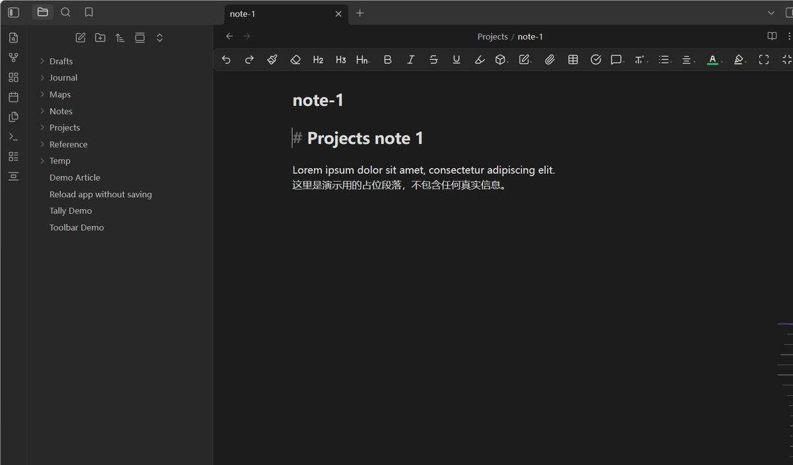

# Toolbar Pin Toggle

> Keep a toolbar always visible with one hotkey — Editing Toolbar's fixed bottom
> bar, or its top bar.

> **Requires the [Editing Toolbar](https://github.com/PKM-er/obsidian-editing-toolbar)
> plugin.** Both pinning modes act on toolbars that Editing Toolbar provides, so
> this plugin does nothing on its own. If Editing Toolbar is missing, the plugin
> says so on load and in its settings instead of failing silently.

Editing Toolbar's bars come and go: the bottom bar is tied to a mobile-oriented
"show while editing" rule, and the top bar hides itself while you read. This
plugin adds a single toggle that pins whichever one you actually use.

## Two modes

| Mode | Behavior |
|---|---|
| **Fixed bottom toolbar** | Toggles Editing Toolbar's fixed bottom toolbar on and off |
| **Top toolbar** | Keeps Editing Toolbar's top toolbar permanently visible, even in reading view |

Pick one in Settings; switching modes is the whole setting.

## Why

Editing Toolbar's bottom bar is genuinely useful on a desktop with a large
screen, but it appears only while the editor is focused. And its top bar
disappears the moment you stop pointing at it, which makes it hard to reach
while reading. Neither behaviour is configurable. This plugin adds the toggle
and binds it to one key.

It also folds in a set of appearance corrections for Editing Toolbar — fullscreen
background, dark-mode skin, and auto-hide timing — so no extra CSS snippet is
needed. See `styles.css`.

## Usage

Default hotkey: `Alt+Q`. Run **Toggle toolbar pin** from the command palette, or
rebind it in Settings → Hotkeys (search for "Toolbar Pin Toggle").

## Installation

1. Install and enable **Editing Toolbar** first (Settings → Community plugins).
2. Then install this plugin:

**Community plugins:** search for "Toolbar Pin Toggle" in Settings → Community
plugins.

**Manual:** download `main.js`, `manifest.json` and `styles.css` from the
[latest release](https://github.com/yunmin311/toolbar-pin-toggle-obsidian/releases)
into `<vault>/.obsidian/plugins/toolbar-pin-toggle/`, then enable it.

**Beta builds:** add `yunmin311/toolbar-pin-toggle-obsidian` to
[BRAT](https://github.com/TfTHacker/obsidian42-brat).

## Privacy

No network access. No telemetry. No accounts. It toggles a CSS class on the
document body and calls one command in the companion plugin; it touches nothing
else.

## License

[MIT](LICENSE)

---

## 中文说明

**前置依赖**：[Editing Toolbar](https://github.com/PKM-er/obsidian-editing-toolbar)。
两种常驻模式都作用于该插件提供的工具条，所以单独装本插件没有效果 ——
未安装时本插件会在加载与设置页里明确提示，而不是静默失效。

一个快捷键两种常驻：

- **底部常驻工具条**：切换 Editing Toolbar 的 fixed 底部工具条
- **顶部工具条常驻**：让 Editing Toolbar 的顶部工具条一直显示（阅读视图下也不再隐藏）

模式在设置里二选一。默认快捷键 `Alt+Q`，可在 设置 → 快捷键 里改（搜 "Toolbar Pin Toggle"）。

安装顺序：**先装 Editing Toolbar**，再装本插件。本插件同时收编了该工具的若干外观修正
（全屏背景、深色模式皮肤、自动隐藏节奏），无需再挂任何 CSS 片段。
